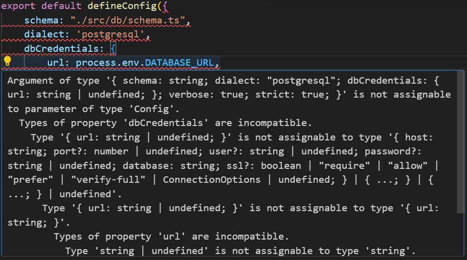

# DevCommit

Welcome to **DevCommit** – a collaborative platform designed for developers to work together on projects in real-time! 🚀

## What is DevCommit?

DevCommit is a space where developers can create rooms based on their projects, allowing others to join in via video chat and collaborate on code. Whether you're working on a personal project, an open-source initiative, or just need some help debugging, DevCommit provides the tools to connect with other developers and get things done together.

## Features

- **Create, Edit, and Delete Rooms**: Easily manage your project rooms.
- **Join Public Rooms**: Collaborate with other developers on open projects.
- **Real-Time Video Conferencing**: Communicate with your team while coding together.
- **Free Access**: Sign in, explore, and start collaborating without any cost.

## Technologies Used

- **[Next.js](https://nextjs.org/)**: The backbone of our project, providing a powerful and flexible framework.
- **[Drizzle ORM](https://github.com/drizzle-team/drizzle-orm)**: Used to define and manage our database schema.
- **[Auth.js](https://authjs.dev/)**: Ensuring smooth and secure authentication for users.
- **[GetStream.io](https://getstream.io/)**: Integrated for seamless video conferencing capabilities.
- **[Vercel Postgres](https://vercel.com/postgres)**: Our choice for reliable and scalable database storage.

## Getting Started

To get started with DevCommit, clone this repository and follow the instructions below:

```bash
git clone https://github.com/yourusername/devcommit.git
cd devcommit
npm install


# Project Setup

This project uses several packages to enhance its functionality. Below is a list of all the packages installed along with their purpose.

## Installation

To set up your development environment, run the following commands:

```sh
npm install next-themes
npm i @radix-ui/react-icons
npm i drizzle-orm postgres
npm i -D drizzle-kit
npx drizzle-kit studio --host localhost --port 3001 --verbose --config drizzle.config.ts
```

Packages
next-themes
Purpose: Used it for managing themes in a Next.js project and has utilities to enable theme switching and customization.

@radix-ui/react-icons
Purpose: This package contains a set of icons for React applications. Used it to enhance the visual representation of the application by providing a variety of icons.

drizzle-orm
Purpose: drizzle-orm is an ORM (Object-Relational Mapper) library that simplifies database operations in JavaScript. It helps in mapping objects in code to relational database tables.

postgres
Purpose: This package is the PostgreSQL client for Node.js. It’s used to interact with a PostgreSQL database to perform database operations.

drizzle-kit (dev dependency)
Purpose: This is a development dependency that includes tools and utilities to work with drizzle-orm. It assists in tasks such as generating schemas and performing migrations.


Debugging: 
 : this error clearly states that, your DATABASE_URL may be undefined, and the type doesn't allow that. DATABASE_URL needs to be confirmed to only be 'string'. In this case you need to add an `!` (non-null assertion operator)

In case you encounter issue related to setting and using Drizzle
try this out once 

```sh
npm i drizzle-orm
npm i -D drizzle-kit
npx drizzle-kit push
npx drizzle-kit studio --verbose
```
to be specific if you start Drizzle studio 
```sh
npx drizzle-kit studio
```
you might see that it gets stucks on page saying `Connecting to the Drizzle Kit on localhost:4983` in that case got to `node_modules/drizzle-kit/bin.cjs` and remove `await certs() ||` try restarting studio again.


# playing with docker
1. list containers: `docker ps`
2. accessing docker : `docker exec -it dev-finder-db psql -U postgres`
3. deleting table: `DROP TABLE IF EXISTS authenticator;`

# ipv6 issues
1. `sudo sysctl -w net.ipv6.conf.all.disable_ipv6=1`
2. `sudo sysctl -w net.ipv6.conf.default.disable_ipv6=1`
3. `sudo sysctl -w net.ipv6.conf.lo.disable_ipv6=1`

# Learnings:
1. Type Inference